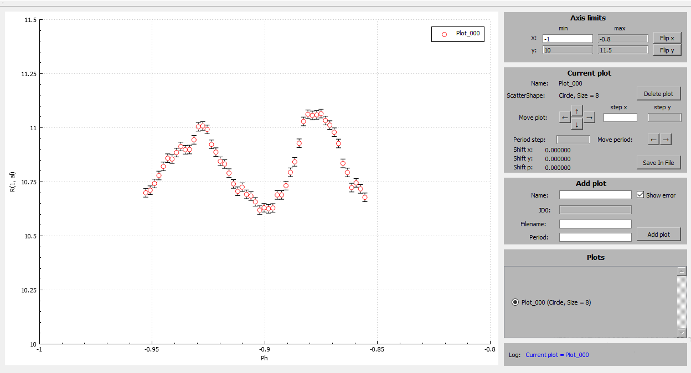

# Easy plotting composite light curves.

* **Scalable code**. Plots Drawer has convenient code structure for modifying and implementing additional features.
* **Convenient platform**. Plots Drawer made with Qt Creator, changing the visual component is easy.
* **Resource efficiency**. CPU and RAM usage is negligible.

# Project structure.

# Plots Drawer Tutorial.

* **Axis limits** - Minimum and maximum coordinate axes.
* **Current plot** - The plot with which we are currently interacting (it was not initially selected).
* **Add plot** - Add a plot from a file. The file must have columns (separated by a space) in the following order: JD, R(1, al), RError. An example file is located in the root of the program folder (data.txt).
* **Plots** - A list of added plots is displayed here. Click on the added plot in the list to interact with it.
* **Log** - If in any of the steps you made a mistake, then Log will let you know about it. The log file throughout the session is located in the root of the program called log.txt.

